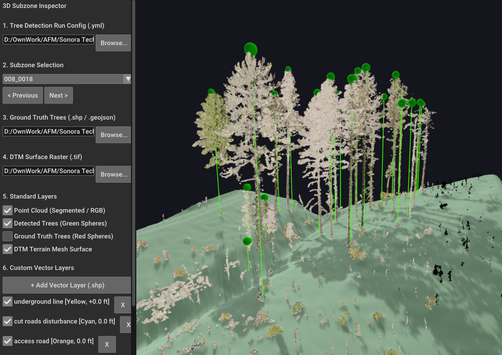
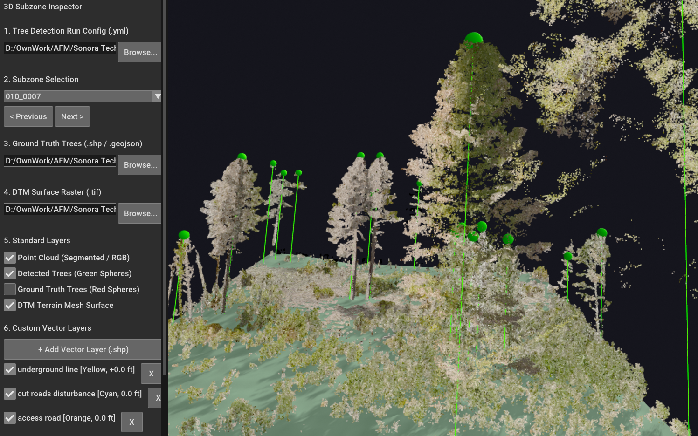
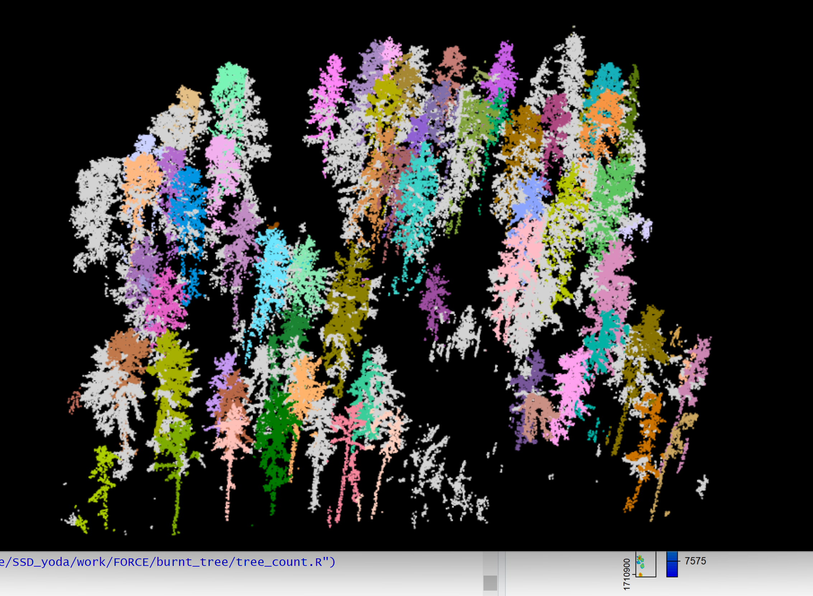
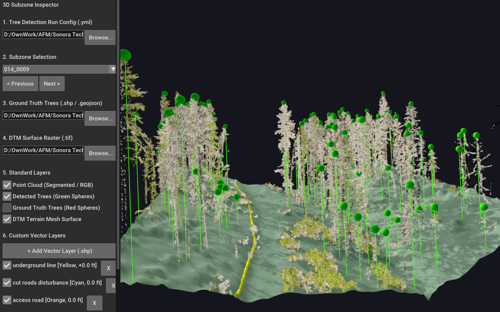
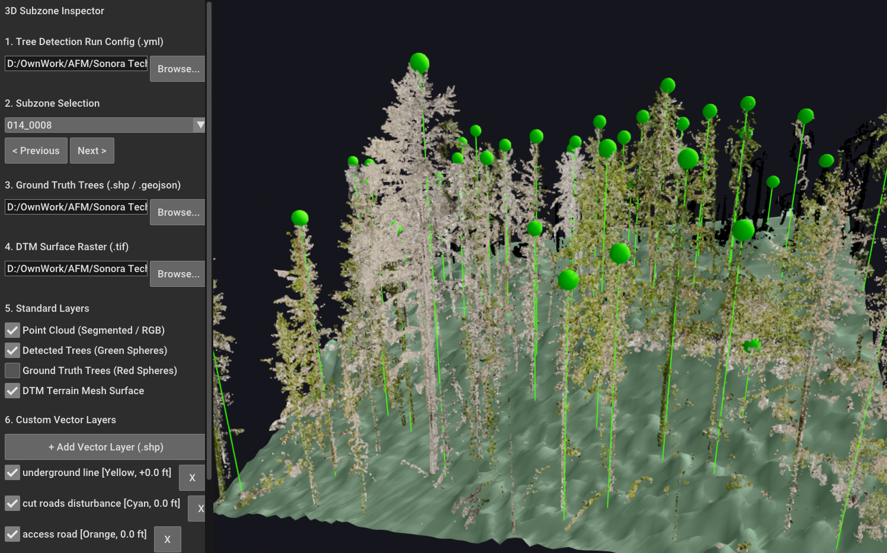

# 🌲 LiDAR 3D Corridor Inspector

A high-performance 3D desktop application for interactive inspection, quality control, and visual analytics of **LiDAR point clouds**, **Canopy Height Model (CHM) detected trees**, **ground-truth validation data**, **Digital Terrain Models (DTM)**, and **draped 3D vector layers**.

Built with **Python**, **Open3D**, **GeoPandas**, **Rasterio**, and **Laspy**.

---

## 📸 Showcase & Demos

### 🖥️ 1. Main Visualizer GUI Overview
Interactive 3D viewport with floating sidebar controls, subzone dropdown navigation, and real-time metric statistics.



---

### 🌲 2. CHM-Detected Trees & Draped Utility Vectors
Detected tree canopy spheres (Green), Ground Truth validation trees (Red), and utility lines draped smoothly over the 3D terrain surface.



---

### 🎨 3. Segmented Point Cloud & Tree Instance Coloring
Point cloud inspection displaying individual tree segments color-coded by tree instance UID and height elevation gradient.



---

### 🏔️ 4. 3D DTM Terrain Surface Draping
Real-time sampling of Digital Terrain Model (DTM) elevation rasters transformed into a 3D terrain surface mesh.



---

### 🔍 5. Full Subzone Tile Inspection View
Tile-by-tile corridor inspection displaying spatial alignments and tree canopy metrics across project tiles.



---

## ✨ Key Features

- **⚡ Fast 3D Point Cloud Rendering**: Renders millions of LiDAR vertices (`.laz` / `.las`) with RGB color, height gradients, or per-tree instance IDs.
- **🌳 Dual Tree Canopy Inspection**: Overlays CHM-detected trees (Green Spheres + Stem Lines) alongside Ground Truth field measurements (Red Spheres + Stem Lines).
- **🏔️ Dynamic DTM Terrain Draping**: Subdivides and drapes 2D vector polylines and polygons over 3D Digital Terrain Model (DTM) raster elevation surfaces.
- **🗺️ Robust GIS Interoperability**: Automatic coordinate reference system (CRS) reprojection (WGS84, UTM, State Plane) and subzone bounding-box clipping.
- **🛠️ Dynamic Vector Layer Manager**: Single-dialog UI for loading, coloring, and toggling custom GIS shapefiles (`.shp`, `.geojson`) on the fly.
- **🖥️ Desktop Native Dialogs**: Integrated native file selection dialogs for seamless file browsing.

---

## 🛠️ Tech Stack & Architecture

| Component | Library / Tool | Description |
| :--- | :--- | :--- |
| **3D Engine** | `open3d` | High-performance OpenGL rendering engine for point clouds, meshes, and line sets. |
| **GIS & Spatial Data** | `geopandas`, `shapely`, `pyproj` | Vector parsing, geometry clipping, and spatial reprojection. |
| **Raster Processing** | `rasterio` | DTM elevation raster sampling and 3D terrain mesh generation. |
| **LiDAR IO** | `laspy`, `lazrs` | LAZ/LAS point cloud file reading and attribute extraction. |
| **Data Processing** | `numpy`, `pandas` | Vectorized coordinate transformations and metrics aggregation. |

---

## 🚀 Quick Start & Installation

### 1. Clone the Repository
```bash
git clone https://github.com/your-username/3d-subzone-lidar-visualizer.git
cd 3d-subzone-lidar-visualizer
```

### 2. Set Up Environment
Using Conda / Micromamba:
```bash
micromamba env create -f environment.yml
micromamba activate gis
```

Or using `pip`:
```bash
pip install -r requirements.txt
```

### 3. Launch the Application
```bash
python visualize_subzone_3d.py
```

Optional CLI parameters:
```bash
python visualize_subzone_3d.py --run-yml "path/to/tree_detection_run.yml"
```

---

## 📜 License
Distributed under the MIT License. See `LICENSE` for more information.
